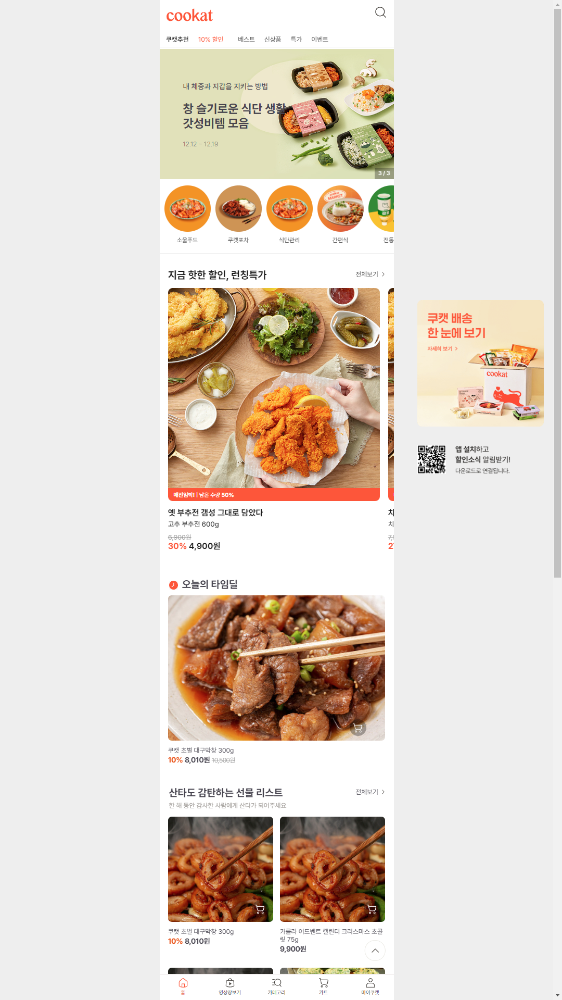
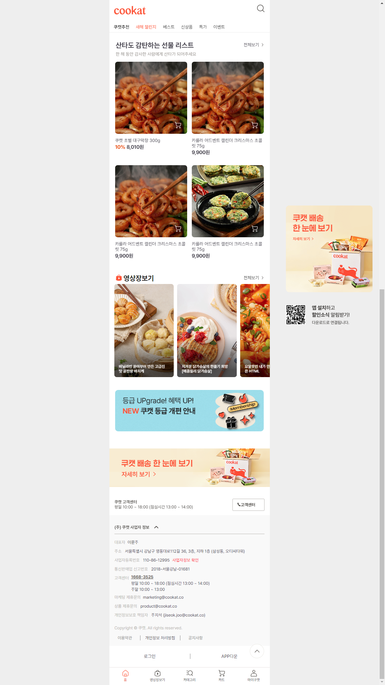
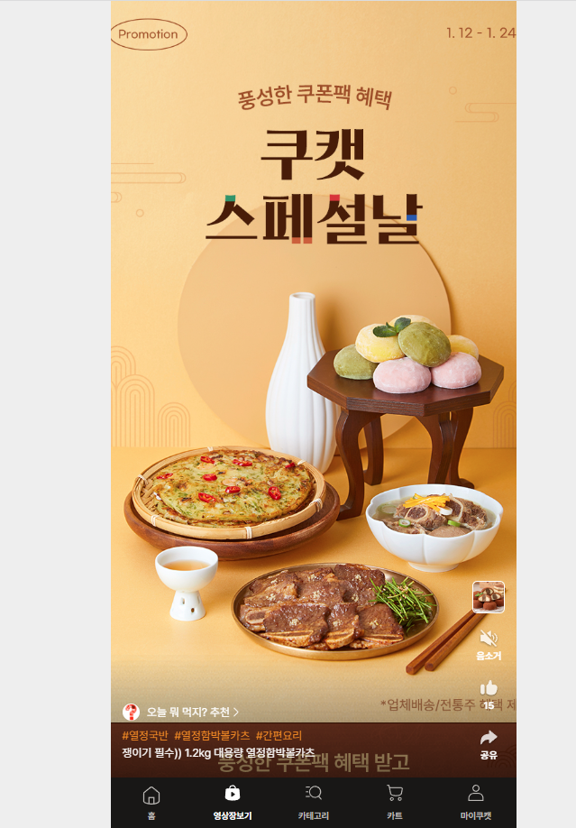
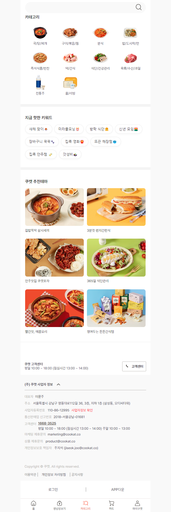
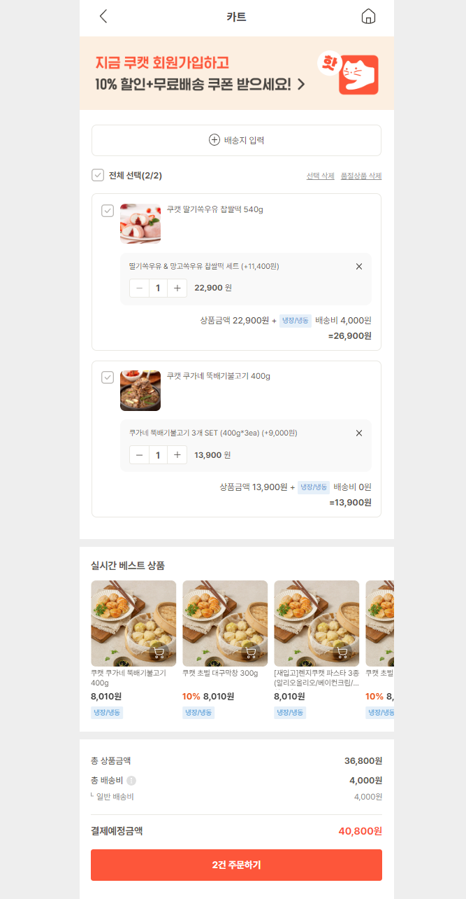
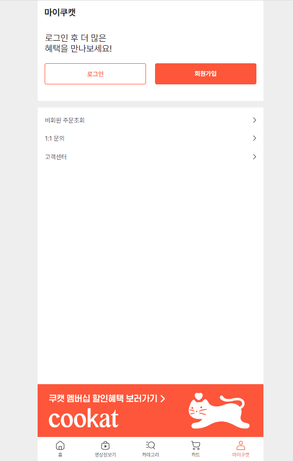
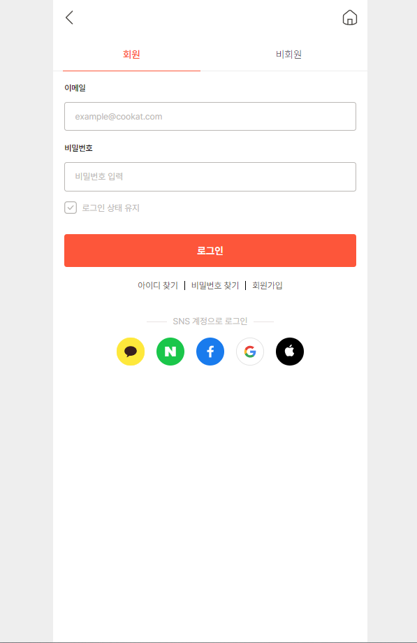
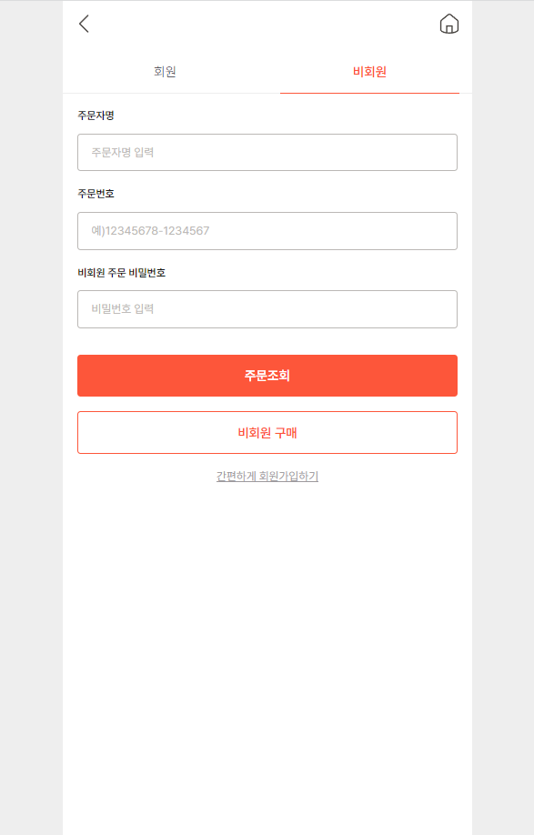

# Cookat

 

> 2022.12 - 2023.01 'Cookat' 클론코딩
>  

 

## 구성원

> - [조윤호](https://github.com/dydgh142)
> - [장세민](https://github.com/semin99)
> - [신선영](https://github.com/SSY1203)

  

---

## Result

### [메인화면](https://github.com/CooKat/Cookat/tree/master/html/home)

  

### [영상장보기](https://github.com/CooKat/Cookat/tree/master/html/video)

  

### [카테고리](https://github.com/CooKat/Cookat/tree/master/html/category)

  

### [카트](https://github.com/CooKat/Cookat/tree/master/html/cart)

  

### [마이쿠캣](https://github.com/CooKat/Cookat/tree/master/html/my-page)

  

---

### References

- [쿠캣 사이트](https://cookatmarket.com/)

   
**Thank you**
