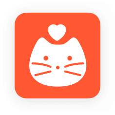

# Cookat

 

> 2022.12 - 2023.01 'Cookat' 클론코딩
>  

 

## 구성원

- [조윤호](https://github.com/dydgh142)
- [장세민](https://github.com/semin99)
- [신선영](https://github.com/SSY1203)
    

---

## Result

### FirstPage - 로그인, 회원가입

> 어플의 첫 화면과 로그인, 회원가입이 가능한 화면이다. 왼쪽화면의 가운데 이미지는 슬라이드되며 어플에 대한 간단한 소개를 보여준다.

 

 

### Find Password, ID - 아이디찾기, 비밀번호 찾기

> 아이디 찾기와 비밀번호 찾기가 가능하다. 비밀번호찾기는 회원가입시 진행하였던 이메일로 임시 비밀번호를 전송하는 기능을 갖고 있다.

 

 

### MainPage - 메인화면 및 운동화면

> 메인화면에는 자신만의 캐릭터가 있다. 우리 어플의 주 기능중 하나인 캐릭터는 퀘스트를 통해 옷을 바꿀 수 있고, 운동을 통해 자세가 변경되는 모습을 볼 수 있다.
> 현재 운동은 스쿼트와 팔굽혀펴기만 가능하다.

 

 

### QuestPage - 퀘스트화면

> 어플의 코인을 얻을 수 있는 유일한 페이지로, 출석체크를 통해 얻거나 퀘스트를 통해 코인을 얻을 수 있다.
> 캘린더 화면은 아직 메모 기능만 있지만 추후에는 운동 갯수나 뱃지 활성여부등을 추가할 예정이다.

 

 

### BoardPage - 게시판화면

> 게시판 작성을 통하여 다른 유저들과 소통할 수 있는 장소이다.

 

 

### ProfilePage - 프로필화면

> 프로필화면에는 닉네임이나 비밀번호를 변경할 수 있고, 로그아웃, 회원탈퇴등이 가능한 곳이다.
> 가운데에 있는 이미지는 뱃지로 퀘스트와는 또다른 동기부여 시스템으로 특정 요건을 충족 시키면 색깔이 들어가며 활성화 되는 시스템이다.

 

 

---

### References

- [Tenserflow.Posenet](https://www.tensorflow.org/lite/examples/pose_estimation/overview)

   
**Thank you**
